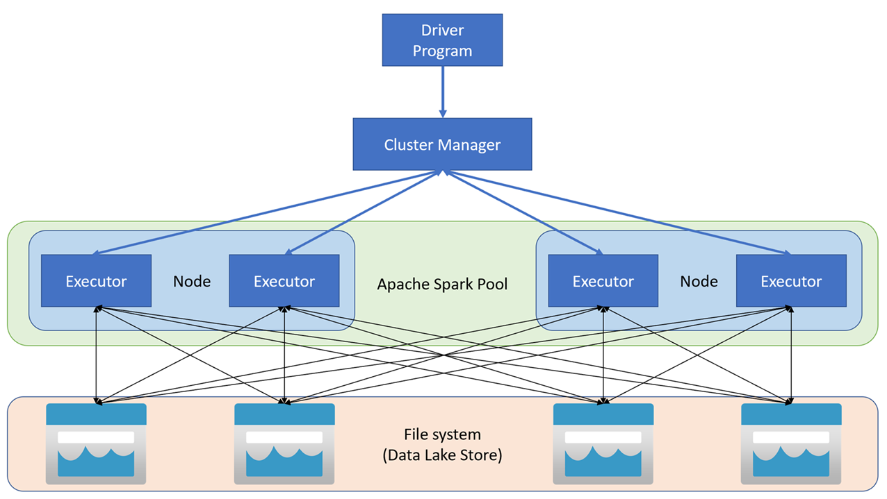

# Az-synapse
## <b> OBJECTIVE: Implement a Data Analytics Solution with Azure Synapse Analytics

<iI><b>Synapse Studio</b> is a web-based portal in which you can manage and work with the resources in your Azure Synapse Analytics workspace.</i>

### 1) Use Azure Synapse serverless SQL pool to query files in a data lake
<u><i>use a serverless SQL pool to query data files in a data lake</i></u>
<li>Transform data using CREATE EXTERNAL TABLE AS SELECT (CETAS) statements</li>
A simple way to use SQL to transform data in a file and persist the results in another file is to use a CREATE EXTERNAL TABLE AS SELECT (CETAS) statement. This statement creates a table based on the requests of a query, but the data for the table is stored as files in a data lake. The transformed data can then be queried through the external table, or accessed directly in the file system (for example, for inclusion in a downstream process to load the transformed data into a data warehouse).

### 2) Analyze data with Apache Spark in Azure Synapse Analytics
<u><i>use a Spark pool to analyze and visualize data from files in a data lake</i></u>

Apache Spark applications run as independent sets of processes on a cluster, coordinated by the SparkContext object in your main program (called the driver program). The SparkContext connects to the cluster manager, which allocates resources across applications using an implementation of Apache Hadoop YARN. Once connected, Spark acquires executors on nodes in the cluster to run your application code.

The SparkContext runs the main function and parallel operations on the cluster nodes, and then collects the results of the operations. The nodes read and write data from and to the file system and cache transformed data in-memory as Resilient Distributed Datasets (RDDs).

### 3) Use Delta Lake in Azure Synapse Analytics
<u><i>use a Spark pool in Azure Synapse Analytics to create and query Delta Lake tables, and query Delta Lake data from a serverless SQL pool</i></u>

Delta Lake is an open-source storage layer that adds relational database semantics to Spark-based data lake processing.

